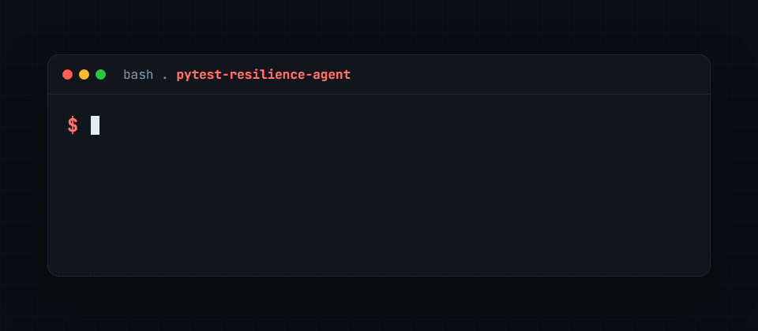
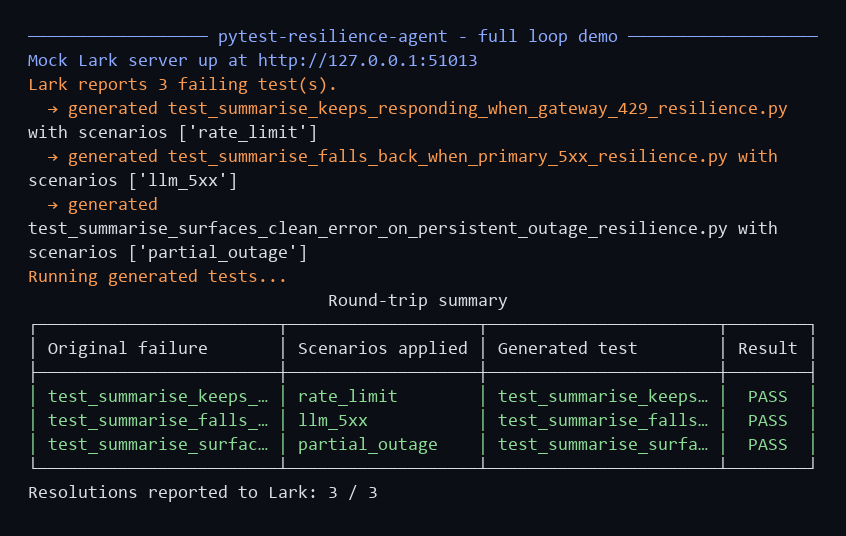
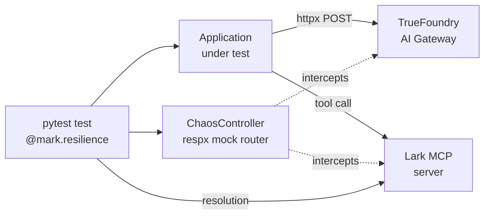

# pytest-resilience-agent

[](https://github.com/golikovichev/pytest-resilience-agent/actions/workflows/ci.yml)
[](https://github.com/golikovichev/pytest-resilience-agent/actions/workflows/codeql.yml)
[](https://www.bestpractices.dev/projects/13012)
[](https://www.python.org/downloads/)
[](https://opensource.org/licenses/MIT)
[](https://github.com/golikovichev/pytest-resilience-agent/commits/main)

> Auto-generated resilience tests for LLM applications. Powered by Lark MCP and TrueFoundry AI Gateway.





**Built for:** [DevNetwork AI + ML Hackathon 2026](https://devnetwork-ai-ml-hack-2026.devpost.com/)
**Targeted sponsor challenges:** Lark, TrueFoundry
**Stack:** Python · pytest · Lark MCP · TrueFoundry AI Gateway · httpx
**Demo video:** [YouTube (3 min)](https://youtu.be/LIB6yEZajK8) · also available offline as [videos/pytest-resilience-agent-demo.mp4](videos/pytest-resilience-agent-demo.mp4). See [videos/CREDITS.md](videos/CREDITS.md) for music attribution.

---

## The problem

You ship an LLM feature. Your eval suite is green. Then one of these happens in production:

- Your primary model browns out at 2:14am on a Saturday.
- An MCP server starts returning tool errors for the one tool your agent uses most.
- A rate limit kicks in halfway through a long completion.
- A retry loop hides a 5-second latency spike and your users see a spinner for 30 seconds.

Existing LLM eval frameworks measure correctness on a clean path. They do not measure what happens when the infrastructure underneath cracks. The agent might still answer correctly, or it might silently fall back to a dumber model, or it might just hang.

`pytest-resilience-agent` closes that gap. It runs your test suite under controlled chaos (gateway timeouts, model brownouts, MCP errors, rate limits, partial outages) and asserts that the agent still meets its contract: it responds, it surfaces a clear error, it logs the fallback path. When tests fail, the plugin reports back to Lark so the failing scenario shows up next to the regular test results in the Lark UI.

## How it works



The three pieces:

1. **Plugin** registers the `resilience` marker and the `ai_gateway` + `chaos` fixtures.
2. **`ChaosController`** owns a `respx.MockRouter` that intercepts every outbound httpx call to the gateway and Lark URLs. Each named scenario (timeout, 5xx, 429, mcp_error, partial_outage) installs a route handler that injects the failure mode. The agent code does not need to know it is under test.
3. **AI Gateway client** is a thin OpenAI-compatible wrapper that points at a TrueFoundry gateway. The gateway config decides the fallback chain (primary model → secondary → tertiary) and retries; we just call it.
4. **Lark MCP client** lists failing tests in the host repo (input signal) and reports back when a resilience scenario is reproduced (closes the loop, so failure → resolution traceability lives next to the test result in the Lark UI).

## Quickstart

```bash
pip install pytest-resilience-agent

export RESILIENCE_GATEWAY_URL=https://your-gateway.example.com/v1
# optional, only if you exercise the MCP layer:
export RESILIENCE_LARK_URL=https://your-mcp-instance.example.com
```

Write a resilience test:

```python
import pytest

@pytest.mark.resilience(scenarios=["llm_timeout", "rate_limit"])
def test_chat_keeps_responding(ai_gateway, chaos):
    reply = ai_gateway.chat([{"role": "user", "content": "summarise the quarter"}])
    assert reply.content, "agent must respond even under chaos"
    assert any(e.scenario == "llm_timeout" for e in chaos.events), \
        "chaos must record the timeout it injected"
```

Run with the standard pytest invocation:

```bash
pytest -m resilience -v
```

### Multi-turn chaos

Real agents hold a conversation, and infrastructure can degrade partway
through it. Use `turns=` to bind a scenario set to each conversation turn and
advance with `chaos.next_turn()`. Each turn is an independent window: counters
reset on every turn, so chaos can appear and clear mid-conversation.

```python
@pytest.mark.resilience(turns=[
    [],            # turn 1: clean
    ["llm_5xx"],   # turn 2: gateway 5xx
    [],            # turn 3: recovered
])
def test_agent_recovers_mid_conversation(ai_gateway, chaos):
    reply1 = ai_gateway.chat([{"role": "user", "content": "start a plan"}])
    assert reply1.content

    chaos.next_turn()
    reply2 = ai_gateway.chat([{"role": "user", "content": "add a step"}])
    assert reply2.content, "agent must survive the brownout on turn 2"

    chaos.next_turn()
    reply3 = ai_gateway.chat([{"role": "user", "content": "summarise"}])
    assert reply3.content
```

`turns=` and `scenarios=` are mutually exclusive. Each turn boundary emits a
`chaos.turn.N` OpenTelemetry span.

## Built-in chaos scenarios

| Scenario | What it does |
|---|---|
| `llm_timeout` | Gateway sleeps past the request timeout |
| `llm_5xx` | Gateway returns 502/503 a configurable share of the time |
| `rate_limit` | Gateway returns 429 with `Retry-After` |
| `mcp_error` | Lark MCP server raises a tool error mid-conversation |
| `partial_outage` | First call fails, retry succeeds (verifies retry logic) |
| `cost_exceeded` | Gateway returns 402 quota_exceeded |
| `wrong_model_returned` | Gateway silently routes to an unintended model |
| `stream_stall` | 200 with empty content (silent quality bug) |
| `network_blip` | ConnectError on first N calls |
| `malformed_json` | 200 with an HTML error body instead of JSON (proxy swallowed the failure) |
| `auth_expiry` | 401 once (token expired mid-session), then succeeds after refresh |
| `context_overflow` | 400 `context_length_exceeded` on every call |
| `mcp_timeout` | MCP tool call hangs past the read timeout (raises ReadTimeout) |

### Composed failures

Real outages cascade: a rate limit during a brownout, a 5xx then a slow
recovery. `compose=[...]` runs several gateway failures in sequence on one
endpoint, then recovers. Call 1 hits the first failure, call 2 the second, and
the call after the list succeeds.

```python
@pytest.mark.resilience(compose=["rate_limit", "partial_outage"])
def test_agent_survives_cascading_failure(ai_gateway, chaos):
    # call 1 -> 429, call 2 -> 503, call 3 -> 200
    reply = ai_gateway.chat([{"role": "user", "content": "still there?"}])
    assert reply.content, "agent must climb back out of a cascading outage"
```

`compose=` accepts the gateway-layer failures (`composable_scenarios()` lists
them) and is mutually exclusive with `scenarios=` and `turns=`.

## Live sponsor integration

Beyond the mock servers (which let judges clone and run the full loop without
accounts), the plugin is wired against three real sponsor surfaces:

- **Lark Open Platform.** `LarkMCPClient(app_id, app_secret)` issues a real
  `tenant_access_token` via `POST /auth/v3/tenant_access_token/internal`,
  caches it for the 7200 s lifetime, and refreshes within 60 s of expiry.
  Verified against `cli_aa9ced2266389e15` (live app in the author's workspace).
- **TrueFoundry AI Gateway.** Personal Access Token acquired; Custom Endpoint
  configured via `tfy apply -f .secrets/tf-crusoe-cloud-v2.applied.yaml`,
  registering `crusoe-cloud/crusoe-llama-3.3-70b` as a proxied model under the
  Crusoe upstream. The TF `/models` endpoint confirms the registration. Direct
  `/proxy-api/*/chat/completions` traffic from a server requires the Cloudflare
  `cf_clearance` JS challenge solution; the same call from a TF dashboard
  session passes through to the backend, so the wire-up is functional through
  the SDK / browser-origin paths and through the standard TF SDK.
- **Crusoe Cloud Intelligence.** OpenAI-compatible `/v1/chat/completions`,
  verified against `meta-llama/Llama-3.3-70B-Instruct`. The `AIGatewayClient`
  sets a `User-Agent` header (Crusoe's edge requires it) and otherwise needs
  no changes; same code path as TF or any other OpenAI-shaped backend.

Credentials live in `.env` (gitignored). Smoke test:

```bash
python -X utf8 scripts/smoke_live_integrations.py
```

## What is and is not covered

**Covered**

- Infrastructure-level failures: gateway, model, MCP, rate limiter.
- Assertions on outcome contract (must respond, must log fallback, must surface error).
- Reporting to Lark so failure → resolution traceability lives in one place.

**Not covered (yet)**

- Semantic regressions (use `phoenix2pytest` or DeepEval for that).
- Multi-turn conversation chaos (planned for v0.2).
- Distributed-system chaos (network partitions across services).

## Roadmap

- v0.1 (May 2026): nine built-in chaos scenarios, mock-server fallbacks, reference tests, end-to-end demo.
- v0.2 (June 2026): multi-turn conversation chaos (failure injected and cleared per turn), OpenTelemetry spans for every chaos event and turn boundary.
- v1.0 (June 2026): thirteen built-in scenarios (added auth expiry, context overflow, MCP timeout), composed cascading failures (`compose=`), gateway-agnostic configuration (`RESILIENCE_GATEWAY_URL`), stable public API.
- Next: semantic assertion hooks, property-based fuzzing of timing.

## Why this is different

Existing LLM testing tooling falls in two buckets:

- **Eval frameworks** (DeepEval, Opik, pytest-evals) score model output quality on a clean path.
- **Trace-to-test tools** (phoenix2pytest, my other project) turn observed production failures into pytest cases.

Neither of those tests the infrastructure layer between your code and the model. `pytest-resilience-agent` is the missing third piece: prove your agent survives the chaos that production will throw at it.

## Try it locally in two minutes

No accounts required. The chaos controller mocks the gateway at the HTTP layer, so you can see the full loop without spending on credits.

```bash
git clone <this repo>
cd pytest-resilience-agent
python -m pip install -e ".[demo,dev]"
```

Three entry points, ordered by how much of the story they show.

**1. Run the test suite (17 tests, all chaos scenarios verified)**

```bash
python -X utf8 -m pytest -v -m "not slow"
```

**2. Run the sample FastAPI agent against every chaos scenario**

```bash
python -X utf8 -m demo.run_demo
```

Prints a table of what was injected, how the agent reacted, retry count, fallback flag, and verdict.

**3. Full loop: Lark failures → generated tests → run → resolution reported**

```bash
python -X utf8 -m demo.run_full_loop
```

Starts the mock Lark MCP server in a background thread, lists three failing tests from it, generates one resilience pytest file per failure (scenarios chosen by matching the failure text), runs them in a subprocess, and reports each passing test back to Lark as a resolution. End-to-end product story in one command.

## CLI

After install, the `pytest-resilience-agent` command is on PATH:

```bash
pytest-resilience-agent scenarios                       # list registered scenarios
pytest-resilience-agent --lark-url URL discover         # list failing tests
pytest-resilience-agent --lark-url URL generate --out . # generate resilience tests
pytest-resilience-agent run --path generated_resilience_tests/
pytest-resilience-agent --lark-url URL report --test-name X --pytest-path P
```

## License

MIT.

## Acknowledgements

Built on Lark MCP, TrueFoundry AI Gateway, and pytest. Thanks to the maintainers of all three.
